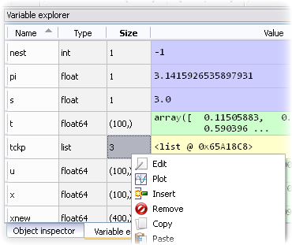

.. -*- mode: rst; mode: flyspell; mode: auto-fill; mode: wiki-nav-*- 

=================
Instalación y uso
=================

Windows
-------

La forma más fácil de instalar *Python* en Windows es descargando `Python(x,y)
<http://www.pythonxy.com/>`_, un programa que además instala las librerías
científicas más importantes del lenguaje. Durante el curso vamos a usar algunas
de ellas para desarrollar varias simulaciones.

Para instalar la más reciente versión de *Spyder* deben seguirse estos pasos:

#. Descargar e instalar este `archivo
   <https://github.com/downloads/zeromq/pyzmq/pyzmq-2.2.0.win32-py2.7.msi>`_,
   el cual es necesario para que *IPython* funcione correctamente.

#. Descargar e instalar la última versión de *IPython* desde este `archivo
   <https://github.com/downloads/ipython/ipython/ipython-0.13.py2-win32.exe>`_

#. Descargar e instalar la última versión de Spyder desde este
   :download:`archivo <../Archivos/spyder-2.2.0dev.win32.exe>`.

MacOS X 
-------

Aunque *Python* viene pre-instalado en las últimas versiones de Mac, no cuenta
con todas las librerías necesarias para realizar computación científica. Por
ello se recomienda descargar el DMG de *Spyder*, que aparece en este `sitio web
<http://code.google.com/p/spyderlib/downloads/list>`_. y que viene con la
versión más reciente de Python y de las librerías mencionadas.

Linux
-----

Las personas que trabajen en Linux deben seguir los pasos que aparecen a
continuación, los cuales son válidos si están usando Ubuntu o cualquier otra
distribución basada en Ubuntu o Debian:

#. Ejecutar el siguiente comando en una terminal::

      sudo apt-get install python-nose

#. Descargar este `archivo
   <http://www.fperez.org/py4science/workshop_checklist.py>`_ de Python. (Para
   ello hacer click derecho sobre el enlace y elegir la opción *Guardar
   enlace/vínculo como...* )

#. Abrir una terminal en el directorio en que fue descargado el archivo
   anterior.

#. Ejecutar el siguiente comando::

       python workshop_checklist.py

#. Después de que haya concluido de ejecutarse este archivo (puede tomar varios
   minutos), ejecutar estos comandos::

       sudo apt-get install virtualenvwrapper

       sudo apt-get install spyder

       sudo apt-get install mercurial
       
       mkvirtualenv --system-site-packages spyder

       workon spyder

       pip install ipython

       pip install --upgrade hg+https://code.google.com/p/spyderlib/

       spyder&

Como utilizar Spyder
--------------------

Spyder_ es un Entorno de Desarrollo Integrado (o IDE por sus siglas en inglés)
que ha sido creado para hacer más sencilla y agradable la creación de programas
científicos en *Python*. Este es el programa que vamos a utilizar para aprender
*Python* y para realizar varios tipos de simulaciones.

.. _Spyder: http://code.google.com/p/spyderlib/

Al iniciar *Spyder* veremos que está compuesto de tres paneles, cada uno de los
cuales consta de uno o más componentes. En la mitad izquierda se encuentra el
**Editor**, que es el componente que se utiliza para escribir el código. Como
puede verse de la imagen, el Editor resalta el código con colores, y completa
nombres de funciones y variables, al oprimir la combinación de teclas
*Ctrl+Espacio*. Además, el Editor reporta errores de sintaxis y omisiones
comunes, para que puedan ser corregidas por el programador antes de intentar
correr su código.

|

.. figure:: ../Imagenes/editor.png
   :align: center

   Editor con varios archivos abiertos

|

La parte derecha está dividida en dos paneles, cada uno de las cuales contiene
varios componentes organizados en pestañas. En la parte de abajo se encuentra
la **Terminal**, que sirve para correr el código que se haya escrito en el
Editor. Para ello se utiliza la tecla *F5*, la cual (si el archivo se corre por
primera vez) abre un cuadro de diálogo que le permite al usuario elegir entre
varias alternativas de ejecución. Además, la Terminal permite interactuar con
las variables del programa (redefinirlas o graficarlas) y correr porciones
código de código que se encuentren en el Editor, para lo cual se seleccione la
porción deseada y se oprime la tecla *F9*.

|

.. figure:: ../Imagenes/consola.png
   :align: center

   Terminal

|

A su lado se encuentra el **Historial de Comandos**, que almacena la historia
de todos los comandos introducidos en la Terminal.

Por otro lado, en la parte superior derecha está el **Inspector de Objetos**
que muestra la ayuda asociada a la función o comando que se desee utilizar en
el momento, por medio de la combinación de teclas *Ctrl+I*. Este componente
también se actualiza automáticamente al escribir un paréntesis después del
nombre de un comando, por lo que es bastante útil.

|

.. figure:: ../Imagenes/object_inspector.png
   :align: center

   Inspector de Objetos

|

A su lado se encuentra el **Explorador de Variables**, que permite revisar,
editar y graficar las variables de los programas que se hayan corrido en la
Terminal.
 
|

   Explorador de Variables

|

..  LocalWords:  Python print Run LocalWords warning from future import math In
..  LocalWords:  division Mathematica image png kill img run ipython verbatim
..  LocalWords:  slicing return def suppress Out in elif else if range False li
..  LocalWords:  True append while for class init self split Imagenes Spyder
..  LocalWords:  Windows MacOS script apt get install virtualenvwrapper
..  LocalWords:  IPython download
